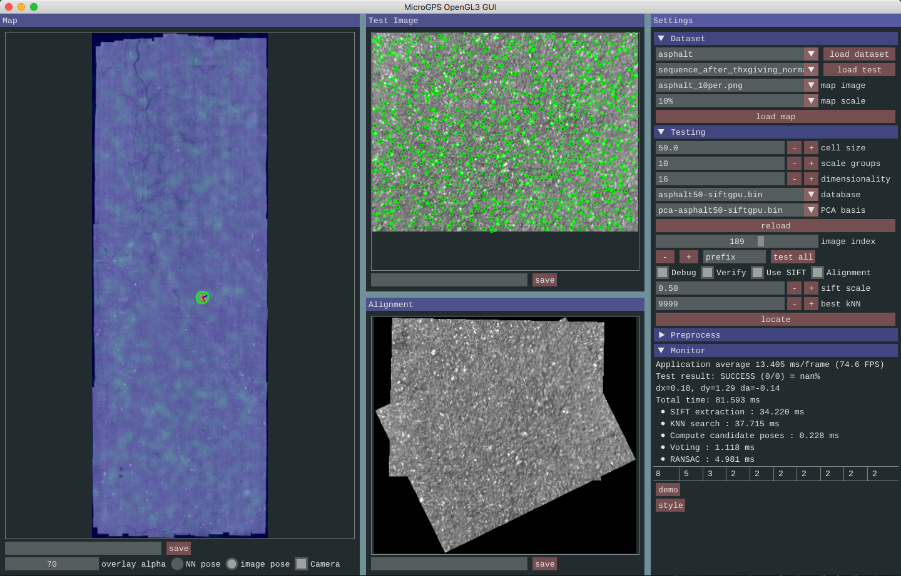

# Micro-GPS

This is the C++ implementation of the Micro-GPS system presented in the paper "High-Precision Localization Using Ground Texture".

### Prerequisites
  - pre-compiled [SiftGPU](https://github.com/pitzer/SiftGPU)
  - pre-compiled [FLANN](https://github.com/mariusmuja/flann)
  - OpenCV2
  - Eigen3
  - GLFW3
  - CUDA (use SiftGPU CUDA mode)
  - gflags


### Compiling
First copy one of the "config*.cmake" template to "config.cmake" and modify the library paths.
```sh
$ mkdir build
$ cd build
$ cmake ..
$ make -j8
```

### To launch the GUI
```sh
$ cd bin
$ ./micro_gps_gui
```

### GUI Instructions:
- Download and extract all datasets into a folder (dataset_root).
- Select the dataset and click "load dataset".
- Use the "Preprocess" section to construct the feature database and stitch a low-res map (e.g., 10%).
- Load a test sequence in the "Dataset" section.
- Load the map in the "Dataset" section.
- In the "Testing" section, set the options and click "reload".
- Click "locate" to run testing on the current frame.

This is a screenshot of the GUI



### Contact
For any question, please email Linguang Zhang (linguang@princeton.edu)